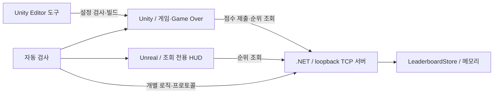
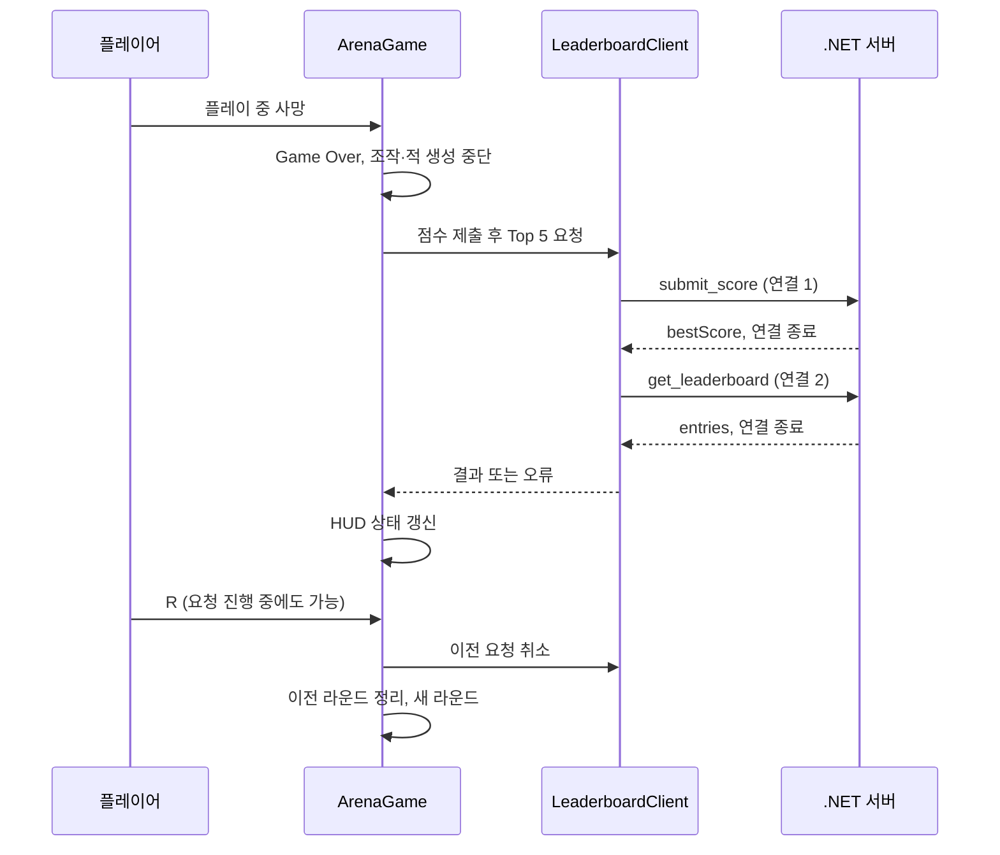

# 아키텍처 설계서

- 문서 버전: `1.0.0`
- 코드 확인일: 2026-09-07 KST
- 확인 기준: `fa834cf`의 소스. 구현 상태의 최신 기준은 [PROCESS](../PROCESS.md)다.
- 관련 문서: [요구사항](REQUIREMENTS.md), [데이터 모델](DATA_MODEL.md), [통신 명세](NETWORK_SECURITY.md), [실행 가이드](DEMO_GUIDE.md)

## 시스템 경계

현재 구현만 그린 구조다. MySQL·외부 호스팅·멀티플레이 동기화는 이 경로에 없다. 두 게임 엔진은 공통 라이브러리를 참조하지 않고 [프로토콜 v1](NETWORK_SECURITY.md)을 각각 구현한다.

## Unity 책임과 실행 순서

| 컴포넌트 | 소유 책임 | 주요 연결 |
|---|---|---|
| [ArenaGame](../Assets/ArenaSystemsLab/Runtime/ArenaGame.cs) | Scene 로드 뒤 부트스트랩, 라운드 생성·정리, 점수, Game Over, HUD | PlayerController, EnemySpawner, LeaderboardClient |
| [PlayerController](../Assets/ArenaSystemsLab/Runtime/PlayerController.cs) | 장치 입력, 이동, 조준, 투사체 생성 | Rigidbody2D, 카메라, Projectile |
| [EnemySpawner](../Assets/ArenaSystemsLab/Runtime/EnemySpawner.cs) | 생성 시점·위치·적 초기화 | ArenaGame의 적 수 상한, EnemyController |
| [EnemyController](../Assets/ArenaSystemsLab/Runtime/EnemyController.cs) | 추적·접촉 공격·상태 표시·적 사망 처리 | EnemyStateMachine, Health, ArenaGame |
| [EnemyStateMachine](../Assets/ArenaSystemsLab/Runtime/EnemyStateMachine.cs) | 입력 조건에 따른 상태 결정만 수행 | Unity 컴포넌트와 분리된 C# 클래스 |
| [Health](../Assets/ArenaSystemsLab/Runtime/Health.cs) | 체력·피해·중복 없는 사망 이벤트 | 플레이어와 적에서 공용 |
| [Projectile](../Assets/ArenaSystemsLab/Runtime/Projectile.cs) | 속도·수명·적 Trigger 충돌 시 피해 | EnemyController |
| [LeaderboardClient](../Assets/ArenaSystemsLab/Runtime/LeaderboardClient.cs) | TCP 프레임, 응답 검사, 타임아웃·재시도·취소 | 게임 오브젝트를 직접 변경하지 않음 |

부트스트랩은 같은 Scene에 `ArenaGame`이 없을 때 생성된다. 라운드 오브젝트와 단색 Sprite는 실행 중 구성하며 별도 게임 Prefab을 요구하지 않는다. `Update`에서 입력을 읽고 `FixedUpdate`에서 Rigidbody2D를 이동한다.

입력은 `Keyboard.current`, `Mouse.current`, `Gamepad.current`를 직접 읽는다. 기존 `InputSystem_Actions.inputactions`는 Editor 검사 대상이지만 현재 이동·공격 코드의 바인딩 공급원이 아니다. 액션 에셋만 바꿔도 조작이 바뀐다고 가정하면 안 된다.

## 라운드와 요청 수명

위 도식은 정상 경로다. 재시도·시간 제한·응답 오류의 정확한 범위는 [통신 명세](NETWORK_SECURITY.md)를 따른다. 재시작과 `OnDestroy`는 요청을 취소하며 취소된 요청의 결과를 다음 라운드 화면에 반영하지 않는다.

## 적 상태 결정

`Evaluate`의 우선순위는 아래 순서다. `Dead`는 같은 상태 머신 인스턴스의 종료 상태다.

| 우선순위 | 조건 | 결과 |
|---:|---|---|
| 1 | 이미 Dead | 유지, 변경 없음 |
| 2 | Health가 사망 상태 | Dead |
| 3 | 게임 종료 또는 행동할 유효 대상 없음 | Idle |
| 4 | 플레이어와 물리 접촉 중 | Attack |
| 5 | 그 외 행동 가능 | Chase |

EnemyController가 조건을 제공하고 실제 이동·공격을 실행한다. 상태가 달라질 때만 색상과 Hierarchy 이름을 바꾼다. 상태별 인터페이스·클래스 계층은 없다.

## 서버와 동시성

[LeaderboardServer](../Server/ArenaSystemsLab.Server/LeaderboardServer.cs)는 `TcpListener`, `SemaphoreSlim`, 연결별 취소 토큰으로 소켓 수명을 관리한다. [WireProtocol](../Server/ArenaSystemsLab.Server/WireProtocol.cs)은 프레임과 요청 검증, [LeaderboardStore](../Server/ArenaSystemsLab.Server/LeaderboardStore.cs)는 점수 규칙을 담당한다.

저장소의 읽기·쓰기·정렬은 하나의 `lock` 안에서 수행한다. 최대 10,000명의 전체 데이터를 정렬하므로 조회마다 처리 비용이 발생한다. 현재 부하 조건에서의 처리량이나 lock 경합 한계는 측정하지 않았다. 서버 검증의 8개 실제 Thread는 동시 갱신 결과를 검사하며 가능한 모든 실행 순서를 증명하지는 않는다.

비동기 I/O와 CPU 병렬 실행은 같지 않다. 이 프로젝트도 소켓의 `async/await`와 저장소 동시 접근 검사를 별도 근거로 다룬다. [Microsoft 비동기 시나리오](https://learn.microsoft.com/en-us/dotnet/csharp/asynchronous-programming/async-scenarios)

## Unreal 실행 경계

[ArenaObserverHUD](../Unreal/ArenaObserver/Source/ArenaObserver/ArenaObserverHUD.cpp)는 `BeginPlay`에서 Engine thread pool 작업을 시작한다. [FArenaLeaderboardClient](../Unreal/ArenaObserver/Source/ArenaObserver/ArenaLeaderboardClient.cpp)가 native socket으로 한 번 조회한 뒤 Game Thread의 `ApplyResult`로 전달한다. `TWeakObjectPtr`로 HUD가 남아 있는지 확인하고 결과 문자열을 저장한다. `DrawHUD`는 저장된 문자열을 그린다.

자동 새로고침과 점수 제출 기능은 없다. 결과를 다시 읽으려면 Play를 재시작한다. 기본 Engine map과 Game Mode/HUD를 재사용하며 새로운 `.umap`이나 외부 아트는 요구하지 않는다. 비활성화한 플러그인은 `AndroidFileServer`, `Fab`, `Bridge`뿐이며 모든 Engine 네트워크 기능을 비활성화했다는 뜻은 아니다.

## 개발 도구와 적용하지 않은 최적화

- [ArenaProjectValidator](../Assets/ArenaSystemsLab/Editor/ArenaProjectValidator.cs): 정확한 Unity 버전, 로드 가능한 활성 Scene 1개 이상, 입력 액션의 `Player/Move`·`Player/Attack` 존재를 검사한다. 컴파일·플레이 성공을 대신 검증하지 않는다.
- [ArenaWindowsBuilder](../Assets/ArenaSystemsLab/Editor/ArenaWindowsBuilder.cs): 위 검사를 통과한 기존 Mono 설정과 활성 Scene으로 Windows x86-64 Development 빌드를 만든다. 백엔드를 자동 변경하지 않는다.
- [SpatialHash2D](../Assets/ArenaSystemsLab/Runtime/SpatialHash2D.cs): 셀별 목록에 위치 스냅샷을 추가하고 반경을 검사하는 독립 실험이다. 위치 갱신·삭제 API나 gameplay 연결이 없으며 현재 충돌 처리는 Unity 물리에 맡긴다.
- Object Pool은 없다. 투사체와 적을 생성·제거한다. 채택하지 않은 이유와 측정 조건은 [성능 기준선](PERFORMANCE_BASELINE.md)에 있다.
