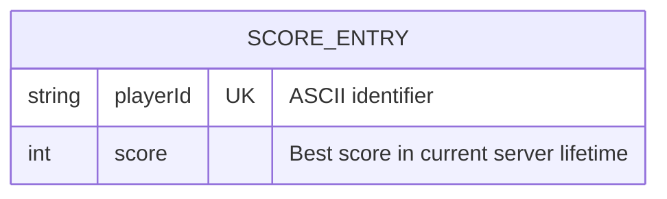

# 데이터 모델 및 ERD

- 문서 버전: `1.0.0`
- 코드 확인일: 2026-09-07 KST
- 확인 기준: `fa834cf`의 [LeaderboardStore](../Server/ArenaSystemsLab.Server/LeaderboardStore.cs), [WireProtocol](../Server/ArenaSystemsLab.Server/WireProtocol.cs)
- 관련 문서: [요구사항](REQUIREMENTS.md), [통신 명세](NETWORK_SECURITY.md), [구현 계획](IMPLEMENTATION_PLAN.md)

## 현재 저장 방식

현재 서버는 `Dictionary<string, int>`에 플레이어별 최고 점수만 저장한다. 데이터베이스 연결·SQL 테이블·마이그레이션은 없다. 서버 종료 시 데이터는 사라지며 Unity의 라운드 초기화와 서버 저장소의 수명은 서로 다르다.

## 현재 논리 ERD

단일 엔터티만 있으므로 엔터티 간 관계선은 없다. `UK`는 Dictionary 키의 논리적 유일성을 나타내며 SQL UNIQUE 제약이나 실제 테이블이 있다는 뜻이 아니다. `ScoreEntry`는 조회할 때 만드는 반환용 record이며 내부 저장은 문자열 키와 정수 값이다.

ERD는 관계형 데이터베이스뿐 아니라 논리 데이터 모델도 표현할 수 있다. 이 문서는 물리 스키마로 오해하지 않도록 외래 키나 미구현 테이블을 추가하지 않았다. [Mermaid ERD 공식 문서](https://mermaid.js.org/syntax/entityRelationshipDiagram.html)

## 데이터 사전

| 필드 / 상태 | 타입과 범위 | 유일성·수명 | 검증 위치 |
|---|---|---|---|
| `playerId` | 문자열 1~32자, ASCII `A-Z a-z 0-9 _ -` | 대소문자를 구분하는 Ordinal 키, 서버 수명 동안 유지 | WireProtocol |
| `score` | 정수 0~1,000,000 | 해당 ID가 제출한 최고값 | WireProtocol에서 범위 검사, Store에서 최대값 유지 |
| `ScoreEntry[]` | 최대 요청 limit개 | 조회 시 생성되는 정렬된 스냅샷 | Store.GetTop |
| 저장소 용량 | 기본 최대 10,000개 ID | 가득 차도 기존 ID의 최고값 갱신은 가능 | Store.SubmitScore |
| Unity 라운드 점수 | 적 사망당 1 증가, 초기값 0 | 라운드 재시작 때 초기화 | ArenaGame |
| `Health` | 최대 체력 양수, 현재 체력 0 이상 | 해당 컴포넌트 수명 | Health.Configure / ApplyDamage |

Store의 public 메서드는 입력 ID·점수 범위를 다시 검증하지 않는다. 현재 네트워크 진입점이 WireProtocol 검사를 거친다는 전제가 있다. 다른 호출자를 추가할 때 이 경계를 우회하면 안 된다.

`playerId`는 계정이나 인증된 사용자가 아니라 클라이언트가 제시하는 식별 문자열이다. Unity는 고정된 예제 ID `UnityPlayer`를 보낸다. 실제 사람의 이름이나 연락처를 입력·문서 예시에 사용하지 않는다.

## 갱신과 조회 규칙

| 순서 | 입력 / 동작 | 저장 결과 |
|---:|---|---|
| 1 | UnityPlayer가 3점 제출 | UnityPlayer → 3 |
| 2 | 같은 ID가 11점 제출 | UnityPlayer → 11 |
| 3 | 같은 ID가 7점 제출 | UnityPlayer → 11 유지 |
| 4 | 같은 ID가 11점 재제출 | UnityPlayer → 11 유지 |
| 5 | 서버 종료 후 다시 실행 | 빈 저장소 |

Top 5는 다섯 번의 플레이가 아니라 최대 다섯 ID의 최고 점수다. 전체 항목을 점수 내림차순, 동점이면 `StringComparer.Ordinal` 기준 ID 오름차순으로 정렬한 후 요청한 개수만 반환한다. `UnityPlayer`와 `unityplayer`는 다른 키다.

같은 점수를 재제출해도 저장 결과가 달라지지 않는 현재 최대값 규칙은 재시도의 중복 저장을 막는다. 하지만 제출과 조회는 서로 다른 연결·lock 구간이다. 두 요청 사이에 다른 클라이언트가 값을 갱신할 수 있으며 하나의 트랜잭션이 아니다.

## 통신 객체와 저장 엔터티의 구분

`ArenaRequest`는 파싱 결과이고 `health`·`submit_score`·`get_leaderboard` 요청 및 응답 JSON은 전송 형식이다. 이 객체를 DB 테이블로 해석하지 않는다. 필드·오류 정의는 [통신 명세](NETWORK_SECURITY.md)가 기준이다.

## 향후 영속화 경계 — 미구현 계획

[Milestone 6](IMPLEMENTATION_PLAN.md)은 `players`, `runs`, `scores`와 버전별 마이그레이션을 계획한다. 모든 플레이 이력을 최고 점수와 분리하고, 재시도해도 한 플레이가 두 번 저장되지 않는 키가 필요하다.

현재 테이블·열·키·인덱스·트랜잭션·보존 기간은 구현되지 않았으므로 확정된 물리 ERD나 SQL 예제를 제시하지 않는다. MySQL 실행 환경과 커넥터 추가는 승인 후 결정한다. 데이터 수명·중복·서버 재시작·마이그레이션 롤백을 검증한 뒤 이 문서를 갱신한다.
