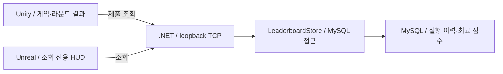
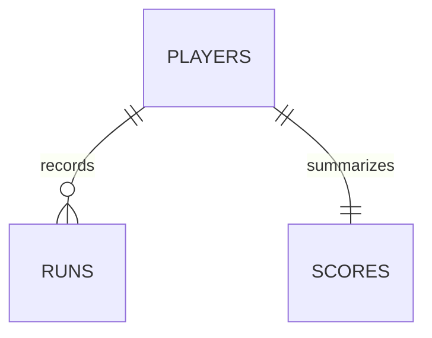

# Arena Systems Lab 기술 완결성 설계서

- 문서 버전: `0.1.1`
- 설계 승인일: 2026-09-09
- 코드 기준선: `f896940`
- 결정: [ADR 0013](adr/0013-technical-completion-design.md)
- 현재 구현·검증 상태: [PROCESS](../PROCESS.md)

이 문서는 단계적으로 적용할 목표 설계다. 단계별 적용 여부는 PROCESS에서 확인하며, MySQL 테이블과 protocol v2가 현재 구현됐다는 뜻이 아니다. 현재 명세는 [기술 문서 5종](../README.md), 실행 명령은 [검증 가이드](DEMO_GUIDE.md)가 기준이다.

## 1. 목적과 범위

기존 게임을 기반으로 Unity, Unreal, Git, SVN, MySQL, network programming, socket programming, multithreading, OOP의 구현과 검증 근거를 완결한다. 코드 존재가 아니라 구현 → 자동 검사 → 사람 실행 → 재현 가능한 기록을 완료 기준으로 삼는다.

기술별 소스와 완료 근거는 [9개 기술 Matrix](IMPLEMENTATION_PLAN.md#최종-기술-범위-matrix)를 따른다. 아래 검증 표는 그 기준을 대체하지 않고 이번 변경의 검사 항목을 구체화한다.

확정한 선택:

- 서버는 MySQL 단일 모드로 전환한다. DB 장애 시 memory fallback은 없다.
- Unity·서버·Unreal을 protocol v2로 함께 전환한다. v1 호환 계층은 없다.
- 기존 이동·전투·Health·FSM·물리·Editor 도구를 재사용한다.
- 성장·아이템·적 종류 확대, 공개 서버, 로그인, multiplayer, 별도 Unreal game은 추가하지 않는다.
- MySQL·connector·SVN 설치와 저장소 외부 쓰기는 별도 승인이다. 설계 승인과 설치 승인은 다르다.

## 2. 목표 구조와 책임



| 컴포넌트 | 설계 책임 |
|---|---|
| ArenaGame | round 식별자 생성, 종료 점수 확정, 취소와 화면 갱신 |
| LeaderboardClient | frame 송수신, 응답 검사, 동일 식별자를 사용하는 제한적 retry |
| WireProtocol | v2 요청의 필수 필드·자료형·범위 검사 |
| LeaderboardServer | 연결 수명·동시 처리 제한, 비동기 요청 분배 |
| LeaderboardStore | 기존 memory 구현을 SQL·연결·transaction 처리로 대체 |
| Unreal observer | v2 조회, 기존 worker 작업과 Game Thread 결과 반영 유지 |

구현이 하나인 store interface·factory·DI container는 만들지 않는다. 서버 Dispatch를 DispatchAsync로 변경하고 DB 작업을 await한다. SQL과 연결 정보는 engine client에 노출하지 않는다.

변경할 주요 호출 계약:

```text
LeaderboardClient.SubmitAndGetLeaderboardAsync(playerId, runId, score, limit, cancellationToken)
LeaderboardStore.SubmitScoreAsync(playerId, runId, score, cancellationToken)
LeaderboardStore.GetTopAsync(limit, cancellationToken)
```

## 3. protocol v2와 라운드 수명

### 유지할 경계

IPv4 `127.0.0.1:7777`, 4-byte big-endian 길이 접두사, UTF-8 JSON, 연결당 요청/응답 1개를 유지한다. 본문 16 KiB, 서버 JSON 깊이 8, 동시 처리 16개, 서버 요청 취소 타이머 5초, player 10,000개 상한도 유지한다.

`health`, `submit_score`, `get_leaderboard`를 유지한다. ID 1~32자 ASCII 영문·숫자·밑줄·하이픈, score 0~1,000,000, query limit 1~100 규칙을 유지한다. 두 engine은 Top 5를 요청한다. 실행 이력은 SQL·검증 도구로 조회하며 별도 이력 화면이나 network API는 만들지 않는다.

기존 본문 구조는 [요청과 정상 응답](NETWORK_SECURITY.md#요청과-정상-응답), 오류 형식은 [오류 계약](NETWORK_SECURITY.md#오류-계약과-알려진-한계)을 참조한다. 해당 명세는 현재 v1이며, v2 변경점은 아래에 구분한다.

### 제출과 응답

다음은 길이 접두사를 제외한 v2 본문 예제다.

```json
{"version":2,"type":"submit_score","playerId":"UnityPlayer","runId":"11111111111111111111111111111111","score":11}
```

```json
{"version":2,"ok":true,"runId":"11111111111111111111111111111111","bestScore":11}
```

- StartRound에서 Guid.NewGuid().ToString("N")으로 runId를 한 번 생성한다. 소문자 16진수 32자이며 전부 0인 값은 거부한다.
- 같은 runId·playerId·score의 재전송은 이력을 추가하지 않고 성공 처리한다. 같은 runId의 다른 내용은 `run_conflict`다.
- 재전송 bestScore는 처리 시점의 최신 최고값이다. 최초 응답과 바이트 단위로 동일할 필요는 없다.
- v1은 `unsupported_version`으로 거부한다. v2 get_leaderboard 형식은 기존에서 version만 바뀐다.
- 서버는 정확한 속성 집합을 검사한다. submit_score는 runId를 포함한 5개다.

### 검증 보강

TryGetInt32 API는 Number 이외의 값에 직접 호출하면 InvalidOperationException을 발생시킨다. 서버 공통 정수 읽기 함수는 호출 전에 ValueKind.Number를 검사해 잘못된 타입을 invalid_request로 거부한다. v1 거부와 v2 필수 속성 검사의 우선순위는 v2 구현 전 회귀 예제로 명확히 한다. [Microsoft API 명세](https://learn.microsoft.com/en-us/dotnet/api/system.text.json.jsonelement.trygetint32?view=net-10.0)

Unity는 JsonUtility를 유지한다. score DTO의 초기값을 -1로 두어 누락과 정상 0을 구별한다. version·ok·배열·ID·범위·정렬·반환 runId를 검사하고 HashSet의 Ordinal 비교로 중복 ID를 거부한다. 초기값의 동작은 exact Editor 테스트로 확인한다. [Unity FromJson 명세](https://docs.unity3d.com/6000.0/Documentation/ScriptReference/JsonUtility.FromJson.html)

이를 모든 JSON 자료형·중복 속성을 검사하는 일반 schema validator로 표현하지 않는다. 서버의 엄격한 요청 검사와 client 검사 범위를 구분한다.

### 재시도와 취소

- 자동 retry는 최대 1회, 250ms 간격이며 같은 runId를 유지한다.
- 연결 실패·부분 응답·시간 초과와 일시적 `storage_unavailable`만 재시도한다. 입력 오류·버전 불일치·run_conflict는 재시도하지 않는다.
- 재시작·OnDestroy는 이전 요청을 취소한다. 성공·실패 모두 UI 반영 직전에 취소 여부와 현재 runId를 확인한다.
- 저장 후 응답만 유실될 수 있으므로 통신 실패를 미저장으로 단정하지 않는다. 확인 불가 상태를 표시한다.
- offline queue는 없다. 서버 부재·취소로 제출되지 않은 round의 영속 저장을 보장하지 않는다.

구현 전 미결 사항: 제출 성공 응답을 받은 뒤 순위 조회만 실패한 경우의 반환값·UI·재시도 대상을 확정해야 한다. 저장 성공이 확인된 경우와 제출 응답 유실로 저장 여부가 불명확한 경우를 구별해야 하며, 이 문서에서는 새 반환 모델을 임의로 선택하지 않는다.

## 4. MySQL 데이터와 동시성

### 구현 예정 ERD와 데이터 사전



| 테이블 | 열과 제약 | 책임 |
|---|---|---|
| players | player_id VARCHAR(32) PK | 제출 식별자 |
| runs | run_id CHAR(32) PK, player_id FK, score INT, submitted_at DATETIME(6) | 수락한 실행별 기록 |
| scores | player_id PK/FK, best_score INT | player별 최고 점수 |
| storage_state | 단일 행 PK, schema_version INT, player_count INT | schema version·기존 용량 상한 |

InnoDB와 ASCII 대소문자를 구분하는 열 비교를 사용한다. score에는 CHECK 0~1,000,000, player_count에는 CHECK 0~10,000을 적용한다. FK는 임의 삭제를 전파하지 않는다. runs는 서버 UTC 수락 시각을 기록한다.

순위 index는 `(best_score DESC, player_id ASC)`, 이력 index는 `(player_id, submitted_at DESC, run_id ASC)`다. 같은 player의 3점·11점은 이력 2개와 최고 11점 한 개다. 자동 삭제·보존 기간 만료는 만들지 않는다.

### 제출 transaction

1. 요청 전용 연결과 ReadCommitted transaction을 시작한다.
2. storage_state 단일 행을 SELECT FOR UPDATE로 잠근다.
3. 기존 runId가 동일 내용이면 현재 bestScore만 조회하고 종료한다. 다른 내용이면 rollback한다.
4. 신규 player의 용량을 검사하고 player와 counter를 함께 추가한다.
5. runs를 삽입하고 scores를 기존값과 제출값 중 큰 값으로 갱신한다.
6. commit 성공 뒤에만 성공 응답을 작성한다.

모든 값은 parameterized query로 전달한다. player·run·score·counter는 하나의 transaction에 포함한다. 단일 관리 행 잠금으로 제출 쓰기를 직렬화하지만 socket 처리·조회까지 애플리케이션 lock으로 묶지 않는다. 실제 경합 병목이 측정될 때만 잠금 분할을 검토한다. [MySQL 잠금 읽기](https://dev.mysql.com/doc/refman/8.4/en/innodb-locking-reads.html)

### 연결·실패·보안

- 요청별 연결과 connector pool을 사용하고 pool 상한은 서버 동시 처리 상한에 맞춘다. 한 연결·command·reader를 동시 요청에서 공유하지 않는다. [연결 사용 규칙](https://mysqlconnector.net/troubleshooting/connection-reuse/)
- DB await까지 요청 취소 token을 전달한다. 별도 2초 취소 예산을 적용하되 서버 요청 예산은 연장하지 않는다. command timeout과 전체 작업 취소를 구분하며 벽시계의 절대 상한은 주장하지 않는다. [취소 명세](https://mysqlconnector.net/overview/command-cancellation/)
- 접속·연결 단절·일시적 잠금 실패는 storage_unavailable, SQL·권한·schema 오류는 비재시도 storage_error다. SQL·연결 문자열·stack trace를 응답과 일반 log에 넣지 않는다.
- 시작 시 DB 연결·schema version 실패는 비정상 종료다. 실행 중 DB 장애에도 memory fallback은 없다.
- health는 process의 protocol 응답 검사다. DB 정상 여부는 실제 저장·조회로 확인한다.
- DB port도 host loopback에만 게시한다. 실행 계정은 필요한 SELECT/INSERT/UPDATE만 허용하고 migration 계정은 분리한다.
- 연결 정보는 process별 환경 설정으로 주입한다. credential·volume·원본 log를 Git에 넣지 않으며 loopback을 인증으로 간주하지 않는다.

구현 전 미결 사항: DB 2초 예산의 시작점과 적용 단위, 연결·pool 대기·transaction·commit의 포함 범위를 확정해야 한다. 각 호출마다 2초를 새로 부여하는지 전체 DB 작업이 공유하는지 현재 문구만으로 가정하지 않는다.

### migration과 복구

버전이 있는 SQL을 명시적으로 적용하고 서버 시작 시 자동 DDL은 하지 않는다. 부분 적용·알 수 없는 schema는 자동 수정하지 않는다. DDL은 일반 ROLLBACK으로 복구되지 않으므로 백업 복원과 빈 test schema 재생성을 구분한다. 실제 데이터 삭제는 별도 승인이다. [MySQL 암묵적 commit](https://dev.mysql.com/doc/refman/8.4/en/implicit-commit.html)

기존 memory score와 존재하지 않는 과거 run을 자동 이관하거나 생성하지 않는다.

## 5. 검증과 완료 기준

기존 Unity Test Framework와 server verification executable을 확장한다. 새 test framework·ORM·자동화 platform은 추가하지 않는다.

| 영역 | 필수 검사와 합격 기준 |
|---|---|
| Parsing | string/null/bool 숫자, 누락·중복 필드, 길이·범위·version 위반을 명세대로 거부하고 저장 변화 없음 |
| Unity response | 누락 score와 정상 0 구분, duplicate ID·정렬·runId·부분 응답 검사 |
| Persistence | 3점·11점 제출 후 재시작해도 runs 2개, 최고 11점 유지 |
| Idempotency | commit 뒤 응답 유실·재전송에도 run 1개, 같은 runId의 다른 내용 거부 |
| Transaction | 중간 실패에 부분 데이터 없음. commit 여부 불명확 시 같은 runId로 확인 |
| Multithreading | 실제 8개 Thread의 고유·중복 run과 용량 경계 경쟁에서 이력 수·최고값·counter 일치, worker 오류 수집 |
| Unity gameplay | 서버 없음·DB 장애·정상 연결·요청 중 R에도 게임 유지, 이전 응답의 새 round 반영 없음 |
| Unreal | v2 fixture·server 없음·actual server 검사, C++ build와 HUD 사람 확인 |
| End-to-end | 같은 서버의 Unity 제출 → Unreal 표시 → server 재시작 → 재조회 일치 |
| Data structure | [SpatialHash2D.Query](../Assets/ArenaSystemsLab/Runtime/SpatialHash2D.cs)를 [기존 테스트](../Assets/ArenaSystemsLab/Tests/EditMode/SpatialHash2DTests.cs)에서 query마다 brute-force 결과 ID·중복 개수와 비교, 개수 합계만 비교하지 않음 |
| Engineering | Health·FSM 회귀, 이동·충돌·공격·사망·재시작, Editor validator·builder 유지 |

DB 검사는 전용 database와 계정에서만 실행한다. 안전한 test 대상이 확인되지 않으면 중단하고 부분 PASS를 전체 PASS로 표시하지 않는다. async/await 사용과 실제 Thread 일관성 검사를 별도 근거로 기록한다.

현재 적 상한과 실제 공격을 포함한 Windows 플레이에서 frame time·할당·객체 수를 측정한다. 기존 무입력 Editor 수치와 개선율을 직접 비교하지 않는다. Object Pool·gameplay Spatial Hash는 측정된 병목과 소비자가 생길 때 별도 결정한다.

SVN은 승인된 Git 외부 공간에서 trunk/branches/tags, 두 working copy, 같은 줄 충돌·해결·merge를 재현한다. revision·mergeinfo·최종 clean을 대조하고 Git에는 익명화한 절차와 결과만 남긴다. 실제 팀 협업으로 표현하지 않는다.

## 6. 실행 순서와 승인 gate

| 순서 | 작업 | 통과 기준 |
|---|---|---|
| 1 | 설계·ADR·계획·PROCESS 연결 | 문서 일관성·링크·정보 경계 |
| 2 | 현재 v1 검증과 spatial test 보강 | 기존 동작·회귀 검사 |
| 3 | 승인된 MySQL·connector·schema | 실제 연결·migration·복구 |
| 4 | DB store와 세 프로그램 v2 전환 | 영속화·동시성·protocol·engine 검사 |
| 5 | isolated SVN lab | revision·충돌·merge 근거 |
| 6 | 최신 Windows build·연속 시연·문서 | 9개 기술 모두 완료 근거 |

v2는 한 통합 작업 branch에서 진행하고 v1/v2 혼재 상태를 완료 상태로 main에 통합하지 않는다. exact Editor, 잠금 부재, Git 상태를 재확인한다.

| 승인 대상 | 이유·버전·영향 | 대안·rollback |
|---|---|---|
| MySQL image | mysql:8.4.11, DB·volume 필요. digest는 다운로드 전 조회·고정 | 기존 설치 재사용 조사. 미승인 시 중단. volume 보존, 삭제·downgrade 자동 실행 금지 |
| MySqlConnector | 2.6.2, MIT. Server NuGet.Config·csproj·lock 변경 | Oracle connector는 별도 승인 대안. 철회 시 이전 executable set 사용, package 제거는 검토 후 별도 commit |
| 간접 dependency | net10.0 명세의 Microsoft.Extensions.DependencyInjection.Abstractions와 Microsoft.Extensions.Logging.Abstractions, 각각 >=8.0.2. 해석 결과 lock 고정 | 숨기거나 DI framework 도입으로 확대하지 않음. 미승인 시 connector 도입 중단 |
| SVN·외부 공간 | svn·svnadmin·격리 working copy. binary version·출처·권한·대상 먼저 확인 | 기존 도구 재사용 우선. 미승인 시 lab 중단. 결과 보존 후 승인으로 정리 |

설계의 배포 근거: [Docker Official Images](https://raw.githubusercontent.com/docker-library/official-images/master/library/mysql), [MySqlConnector 2.6.2](https://www.nuget.org/packages/MySqlConnector/2.6.2), [Apache SVN binary 안내](https://subversion.apache.org/packages.html). 로컬 설치나 보안 검증이 완료됐다는 뜻은 아니다.

## 7. 기록과 변경 관리

기술 명세 5종은 구현된 내용만 갱신하고 미래 설계는 이 문서를 참조한다. 현재 상태는 PROCESS, 결정은 ADR, 새 용어는 [glossary](GAME_DEV_GLOSSARY.md), AI 작업은 [AI_USAGE](AI_USAGE.md)에 남긴다.

단계별 work branch에서 실제 검사와 NOT RUN을 담아 commit·push한다. source commit, tool version, 날짜, 검사 범위, build hash를 기록하되 개인정보·장치 절대 경로는 제외한다. 새 명령은 실행 전까지 Not yet verified다.

최종 DONE은 9개 기술의 source·자동/사람 검증, 현재 Windows build, 같은 서버의 Unity–MySQL–Unreal 흐름, SVN 실습, 사실에 맞는 문서가 모두 갖춰진 때만 선언한다.

## Version History

| Version | Date | 변경 |
|---|---|---|
| 0.1.1 | 2026-09-09 | API 예외 설명·기술/검사 링크·간접 package 이름 명확화, v2 부분 성공·검사 우선순위·DB 예산 미결 사항 표시. 구현 계약 추가 확정 없음 |
| 0.1.0 | 2026-09-09 | MySQL 단일 모드·v2·중복 방지·동시성·검증·승인 경계 |
